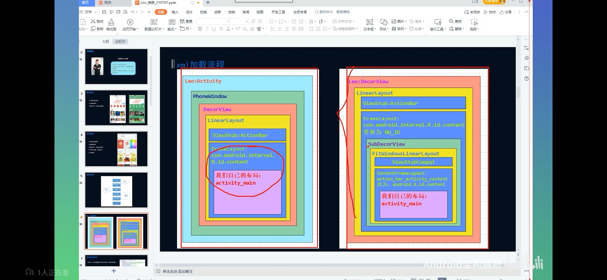

### 一、Activity和Window、DecorView的关系



### 一、拦截view的绘制过程

view的绘制过程

```sequence
-> LayoutInflact:setContentView()
LayoutInflact -> LayoutInflact:inflate()
LayoutInflact -> LayoutInflact:createViewFromTag()
LayoutInflact -> LayoutInflact:root_createViewFromTag()
LayoutInflact -> LayoutInflact:root_rInflateChildren()
LayoutInflact -> LayoutInflact:child_createViewFromTag()
LayoutInflact -> LayoutInflact:tryCreateView()
LayoutInflact -> LayoutInflact:onCreateView()
LayoutInflact -> LayoutInflact:CreateView()
```

1、获取activity的LayoutInflact，设置SetFactory2()
2、创建SkinLayoutInflact继承LayoutInflact，具体实现onCreateView()
3、在onCreateView()方法中分别创建SDKView和自定义View

4、view创建成功之后，遍历该view的AttributeSet

5、使用AttributeSet.getAttributeValue()获取AttributeSet.getAttributeName()相对应的app资源id

6、使用app资源id，获取对应的资源类型和资源名称

7、根据具体的资源类型+资源名称获取其在插件化资源包中的资源id

### 二、加载皮肤资源库

AssetsManager的创建过程

```sequence
@startuml

ActivityThread-> ActivityThread:performLaunchActivity()

ActivityThread-> ContextImpl:createActivityContext()
ActivityThread-> ContextImpl:createAppContext()

ResourcesManager-> ResourcesManager:createResourcesImpl()
ResourcesManager-> ResourcesManager:createAssetManager()

@enduml
```

1、通过反射创建AssetsManager实例，并通过反射调用其addAssetPath方法

2、使用AssetsManager的实例创建插件资源相对应的对象resource

3、对外提供获取插件化资源的各种方法