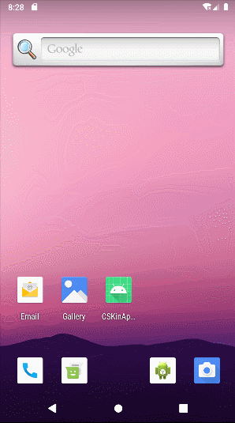
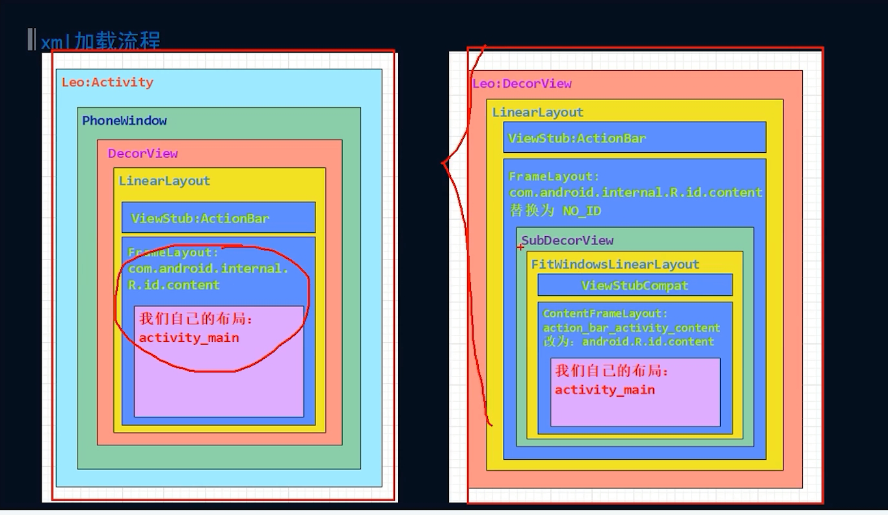
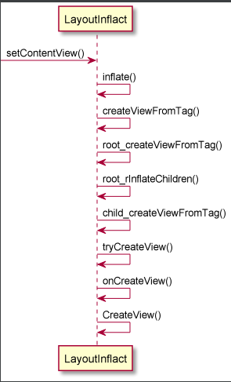
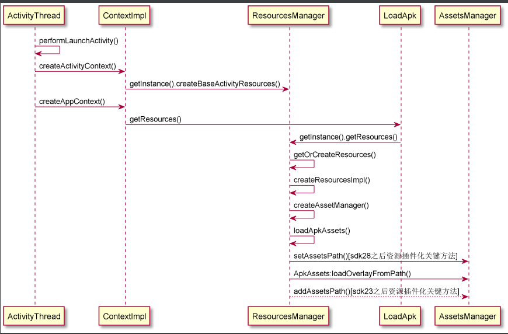

### 项目运行效果图



### 如何使用

主app中初始化

```java
public class CKApplication extends Application {
    @Override
    public void onCreate() {
        super.onCreate();
        SkinManager.init(this);
    }
}
```
在activity中的调用
```java
public class MainActivity extends AppCompatActivity {

    @Override
    protected void onCreate(Bundle savedInstanceState) {
        setContentView(R.layout.activity_main);
        findViewById(R.id.btn_change_skin).setOnClickListener(new View.OnClickListener() {
            @Override
            public void onClick(View v) {
                File apkPluginFile = new File(Environment.getExternalStorageDirectory() + "/app_plugin.apk");
                if (apkPluginFile.exists()) {
                    String apkPluginResPath = apkPluginFile.getAbsolutePath();
                    SkinManager.getInstance().loadSkinResource(apkPluginResPath);
                    SkinManager.getInstance().changeActivitySkin(MainActivity.this);
                }
            }
        });
    }
}
```
### 二、拦截view的绘制流

### 验证流程

SkinResource模块为皮肤插件化模块，编译该模块生成[app_plugin.apk](SkinResource/release)

> adb push app_plugin.apk sdcard

1、使用adb把该app_plugin.apk复制到手机SD卡根目录

2、然后再运行app模块，授权允许访问外部SDK，点击换肤按钮即可实现换肤

本项目主要分两个大的方面：

### 二、拦截view的绘制过程

1、通过application获取所有activity生命周期的监听事件 
2、在activity的onCreate方法中获取activity的LayoutInflact，设置SetFactory2()
3、创建SkinLayoutInflact继承LayoutInflact，具体实现onCreateView()
4、在onCreateView()方法中分别创建SDKView和自定义View 5、view创建成功之后，遍历该view的AttributeSet
6、使用AttributeSet.getAttributeValue()获取AttributeSet.getAttributeName()相对应的app资源id
7、使用插件化模块中的资源替换原来的资源

### 二、加载皮肤资源库

AssetsManager的创建过程

1、通过反射创建AssetsManager实例，并通过反射调用其addAssetPath方法

2、使用AssetsManager的实例创建插件资源相对应的对象resource

3、对外提供获取插件化资源的各种方法

### 三、几张比较重要的图片

- Activity和Window、DecorView的关系



- view的创建流程



- AssetsManager的创建过程




